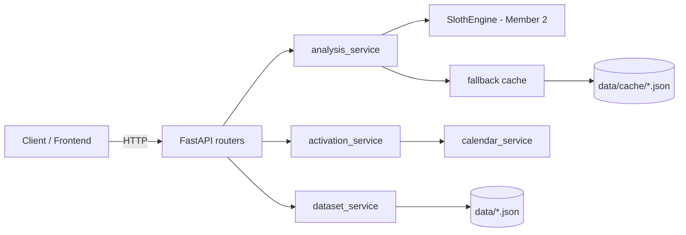

# FlowFix Backend — Architecture & API Reference

The backend is a FastAPI app (Member 3, data + API layer) that wraps Member 2's
AI/scoring engine (`SlothEngine`). It serves a raw demo dataset, runs workflow
analysis / forecasting / effectiveness scoring, and simulates activating the
meeting-scheduling automation. Every endpoint is demo-safe: if the LLM or engine
fails, responses fall back to bundled demo data so the demo never 500s.

## Request flow



## Layout

```text
backend/app/
  main.py                     # FastAPI app + router registration
  models.py                   # Member 3 response models (demo data, activation)
  schemas.py                  # Member 2 contracts (workflow, forecast, scoring)
  engine.py                   # Member 2 SlothEngine facade
  routers/
    demo.py                   # GET /api/demo-data
    analysis.py               # analyse / generate / forecast / effectiveness
    activation.py             # POST /api/activate-automation
  services/
    dataset_service.py        # load + validate raw demo dataset
    email_normaliser.py       # group flat emails into ordered threads
    calendar_service.py       # find_available_slots()
    analysis_service.py       # wraps SlothEngine + fallback cache
    activation_service.py     # activation simulation (in-memory state)
    fallback.py               # on-disk demo fallback (data/cache)
  data/
    demo_emails.json          # 60 emails across 15 threads
    demo_calendar.json        # 20 calendar events
    cache/                    # pre-generated fallback fixtures
```

## Running locally

```bash
cd backend
python3 -m venv .venv && source .venv/bin/activate
pip install -r requirements.txt
uvicorn app.main:app --reload    # http://127.0.0.1:8000
```

`OPENAI_API_KEY` is optional. Without it, workflow extraction uses demo data.

---

## Endpoints

### GET /health

Liveness probe.

Response `200`:

```json
{ "status": "ok" }
```

### GET /api/demo-data

Returns the raw demo dataset (scheduling emails + calendar events). This is the
input the engine analyses; it is not a pre-summarised payload.

Response `200` (truncated):

```json
{
  "emails": [
    {
      "thread_id": "thread-001",
      "subject": "Kickoff sync for Q3 roadmap",
      "sender": "Priya Nair <priya.nair@northwind.io>",
      "recipient": "Daniel Okafor <daniel.okafor@northwind.io>",
      "timestamp": "2026-06-01T09:14:00+00:00",
      "body": "Hi Daniel, I'd like to set up a kickoff..."
    }
  ],
  "calendar_events": [
    {
      "event_id": "evt-001",
      "title": "Q3 Roadmap Kickoff",
      "start_time": "2026-06-02T10:00:00+00:00",
      "end_time": "2026-06-02T10:45:00+00:00",
      "attendees": ["priya.nair@northwind.io", "daniel.okafor@northwind.io"]
    }
  ]
}
```

### POST /api/analyse-workflow

Detects the repeated scheduling workflow. Body is optional; when omitted, the
bundled demo threads are used. Without an OpenAI key it returns demo workflow
data.

Request body (optional):

```json
{ "email_threads": null, "demo_mode": false }
```

Response `200` (truncated):

```json
{
  "workflow_name": "Email-to-Calendar Meeting Scheduling",
  "occurrence_count": 47,
  "current_steps": [
    {
      "step_id": "step_1",
      "name": "Read incoming meeting request",
      "description": "Triage inbound email asking to schedule a meeting.",
      "is_manual": true,
      "avg_minutes": 2.0,
      "is_automatable": true,
      "requires_approval": false
    }
  ],
  "bottlenecks": [
    {
      "step_id": "step_3",
      "reason": "Manual cross-referencing of multiple calendars is slow and error-prone.",
      "severity": "high"
    }
  ],
  "opportunity_score": 78.5,
  "automation_proposal": [ "<WorkflowStep>, ..." ],
  "assumptions": ["Meetings default to 30 minutes unless stated otherwise."],
  "automation_rules": {
    "internal_contacts_only": true,
    "meeting_duration_minutes": 30,
    "working_hours_start": "09:00",
    "working_hours_end": "18:00",
    "approval_required": true,
    "max_slots_proposed": 3
  }
}
```

### POST /api/generate-automation

Returns the future-state automation proposal (`list[WorkflowStep]`) for a
detected workflow. Body is optional; defaults to the demo workflow. The editable
rule config lives in `automation_rules` on the `analyse-workflow` response.

Request body (optional):

```json
{ "workflow": null }
```

Response `200` (truncated):

```json
[
  {
    "step_id": "step_1",
    "name": "Read incoming meeting request",
    "description": "Triage inbound email asking to schedule a meeting.",
    "is_manual": false,
    "avg_minutes": 2.0,
    "is_automatable": true,
    "requires_approval": false
  },
  {
    "step_id": "step_5",
    "name": "[Approval] Confirm time with manager",
    "description": "Get sign-off before committing external-facing slots.",
    "is_manual": true,
    "avg_minutes": 2.0,
    "is_automatable": true,
    "requires_approval": true
  }
]
```

### POST /api/forecast

Forecasts time saved. Body is required (`ForecastInputs`).

Request body:

```json
{
  "eligible_runs": 40,
  "manual_minutes_per_run": 18.0,
  "review_minutes_per_run": 3.0,
  "exception_minutes": 12.0
}
```

Response `200`:

```json
{
  "eligible_runs": 40,
  "manual_minutes_per_run": 18.0,
  "review_minutes_per_run": 3.0,
  "exception_minutes": 12.0,
  "conservative_hours_saved": 6.86,
  "likely_hours_saved": 9.8,
  "optimistic_hours_saved": 11.76
}
```

Invalid inputs (e.g. negative `eligible_runs`) return `422`.

### GET /api/effectiveness

Returns the seeded post-automation effectiveness breakdown.

Response `200`:

```json
{
  "realised_time_score": 24.0,
  "coverage_score": 16.0,
  "reliability_score": 15.0,
  "quality_score": 12.0,
  "cycle_time_score": 5.0,
  "acceptance_score": 2.0,
  "safety_status": "ok",
  "overall_score": 74.0,
  "recommendation": "Good performance. Monitor exception rate."
}
```

Safety cap: a major error / privacy issue / wrong recipient / recurring failure
sets `safety_status` to `needs_review` and caps `overall_score` at 40.

### POST /api/activate-automation

Stores the activated rules (in-memory) and processes one mock scheduling email:
proposes slots (avoiding existing calendar events), drafts a reply, creates a
tentative event, and logs the run. Body is optional.

Request body (optional):

```json
{
  "rules": {
    "internal_contacts_only": true,
    "meeting_duration_minutes": 30,
    "working_hours_start": "09:00",
    "working_hours_end": "18:00",
    "approval_required": true,
    "max_slots_proposed": 3
  },
  "incoming_email": {
    "sender": "Jordan Lee <jordan.lee@northwind.io>",
    "recipient": "you@northwind.io",
    "subject": "Quick sync next week?",
    "body": "Hi - could we find some time next week to review the Q3 plan?",
    "requested_duration_minutes": 30
  }
}
```

Response `200` (truncated):

```json
{
  "rules": { "meeting_duration_minutes": 30, "max_slots_proposed": 3, "...": "..." },
  "processed_email_subject": "Quick sync next week?",
  "draft_reply": "Hi,\n\nThanks for the note. Here are a few times that work:\n- ...",
  "proposed_slots": [
    {
      "start_time": "2026-06-22T09:45:00+00:00",
      "end_time": "2026-06-22T10:15:00+00:00"
    }
  ],
  "tentative_event": {
    "event_id": "evt-bb494e99",
    "title": "Quick sync next week?",
    "start_time": "2026-06-22T09:45:00+00:00",
    "end_time": "2026-06-22T10:15:00+00:00",
    "attendees": ["Jordan Lee <jordan.lee@northwind.io>", "you@northwind.io"],
    "status": "tentative"
  },
  "run": {
    "run_id": "run-bc74fce6",
    "activated_at": "2026-06-27T04:41:59.210957+00:00",
    "email_subject": "Quick sync next week?",
    "proposed_slot_count": 3,
    "created_event_id": "evt-bb494e99",
    "status": "completed"
  }
}
```

If no slot is found, `proposed_slots` is empty, `tentative_event` is `null`, and
`run.status` is `no_slots_found`.

---

## Demo fallback

Two layers keep the demo resilient:

1. Member 2's engine returns demo workflow data when the LLM call fails or no
   `OPENAI_API_KEY` is set.
2. `analysis_service` wraps each call in `cached_call(...)`; any unexpected
   error returns pre-generated JSON from `app/data/cache/` (`workflow.json`,
   `automation.json`, `forecast.json`, `effectiveness.json`).

## Notes & decisions

- Activation state is in-memory and resets on restart (no database).
- Slot times are UTC; activation is anchored to a fixed demo day (`2026-06-22`)
  so existing events visibly shift proposed slots.
- `generate-automation` returns proposal steps; the editable `AutomationRule`
  config is part of the `analyse-workflow` response.
